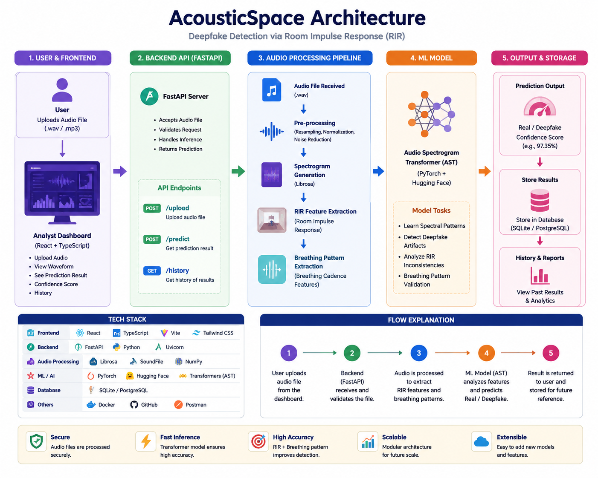

# AcousticSpace

## Project Title
AcousticSpace: Deepfake Audio Detection using  Room Impulse Response (RIR)

## Problem Statement
Current deepfake audio detectors mainly focus on voice characteristics. This project detects deepfake audio using Room Impulse Response (RIR), making detection more reliable.

## Team Members
- Aditya Kokane (Team Leader)
- Backend Developer
- Frontend Developer
- ML Developer

## Tech Stack

### Backend
- Python
- FastAPI

### Frontend
- React + Vite
- TypeScript

### Machine Learning
- PyTorch
- Librosa
- NumPy

## Folder Structure

backend/
frontend/
ml/
docs/
assets/

## Setup Instructions

Coming Soon...

## Current Status

Project Initialization Completed.

## Future Scope

- Improve Detection Accuracy
- Real-time Audio Detection
- Cloud Deployment

- ## Project Architecture

